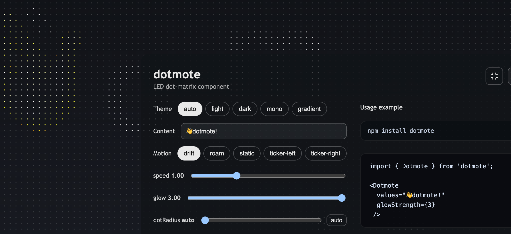

# dotmote



<p align="center">
  <a href="https://www.npmjs.com/package/dotmote"></a>
  
  
  <a href="https://dotmote.imryan.dev"></a>
  <a href="https://stackblitz.com/github/rryanchiu/dotmote"></a>
</p>

<p align="center">[English](README.md) · **简体中文**</p>

> **在线演示** — [dotmote.imryan.dev](https://dotmote.imryan.dev)。

框架无关的点阵发光背景，支持 React 与 Vue。把几个字母、emoji 或形状撒在一片无边的点阵上——它们四处漂移、彼此碰撞，然后从网格里透出光来，像一场小小的灯展。

- **React 18+** · TypeScript · Canvas 2D · **SSR 安全**
- **零运行时依赖** —— 只需 `react`（peer）
- 纯 Canvas 2D，不用任何粒子或点阵库

## 安装

```bash
npm install dotmote
```

需要 `react >= 18`。提供 ESM + TypeScript 类型声明。

## 快速开始

```tsx
import { Dotmote } from 'dotmote';

export function Page() {
  return (
    <div style={{ position: 'relative', minHeight: '100vh' }}>
      <Dotmote theme="gradient" />

      <main style={{ position: 'relative', zIndex: 1, padding: 24 }}>
        <h1>My page</h1>
      </main>
    </div>
  );
}
```

外层包裹的 `<div>` 是绝对定位、垫在所有内容后面——把你的内容放进一个 `z-index` 更高的兄弟节点即可。

## Vue

Canvas 核心与框架无关——React 与 Vue 都只是同一套 `createDotMatrixCore` 的薄封装。Vue 3 用 `dotmote/vue` 入口：

```vue
<script setup>
import { Dotmote } from 'dotmote/vue';
</script>

<template>
  <div style="position: relative; min-height: 40vh">
    <Dotmote values="👋dotmote!" theme="auto" motion="ticker-right" />
  </div>
</template>
```

`class` / `style` 会透传到外层 `<div>`。

## 属性

| Prop | Type | Default | Description |
| --- | --- | --- | --- |
| `values` | `string` | — | 用一个字符串填充内容——每个字符成为一个主体（空白会被跳过）。`items` 的简写。 |
| `items` | `(ContentItem \| string)[]` | `['A','B','C','D','E']` | 要漂移的主体。字符串会变成字母；见 [内容](#内容)。 |
| `theme` | `ThemePreset \| ThemeConfig` | `'mono'` | 预设名，或内联配置（`dotColor`、`activeDotColor`、`glow`、`background`）。 |
| `motion` | `MotionMode` | `'drift'` | 主体的运动方式——见 [动效](#动效)。 |
| `speed` | `number` | `1` | 全局速度倍率。 |
| `glowStrength` | `number` | `1` | 发光强度：`<1` 变淡，`>1` 更亮。（`glowAlpha` 是已废弃的别名。） |
| `dotRadius` | `number` | `spacing <= 9 ? 0.82 : 1` | 点的大小（px）。越大越"颗粒感"。 |
| `fontFamily` | `string` | `"Trebuchet MS", ui-rounded, sans-serif` | 字体栈（字重/字号会自动前置：`900 ${fontSize}px …`）。 |
| `fontSizeOverride` | `number \| ((w)=>number)` | — | 覆盖自动字号。 |
| `fontSizeMin` / `fontSizeMax` | `number` | `207` / `270` | 自动字号钳制的上下界。 |
| `breakpoints` | `Partial<Breakpoints>` | `{small:372, medium:640, …}` | 响应式几何。 |
| `spacingScale` | `number` | `1` | 点阵密度——`<1` 更密，`>1` 更疏。 |
| `introDurationMs` | `number` | `520` | 停留 + 淡入时长。 |
| `className` / `style` | `string` / `CSSProperties` | — | 传给包裹 `<div>`。 |
| `ariaHidden` | `boolean` | `true` | 包裹 `<div>` 的 `aria-hidden`。 |

## 主题

选一个中性预设，或换成你自己的配色：

```tsx
<Dotmote theme="mono" />   // 默认
<Dotmote theme="dark" />
<Dotmote theme="gradient" />

<Dotmote
  theme={{
    dotColor: 'rgba(96, 165, 250, 0.6)',
    glow: ['rgba(56, 189, 248, 0.9)', 'rgba(99, 102, 241, 0.9)', 'rgba(236, 72, 153, 0.9)'],
    background: '#0b1020',
  }}
/>
```

预设：`light`、`dark`、`mono`、`gradient`、`rainbow`。

```ts
interface ThemeConfig {
  dotColor?: string;       // 点阵颜色
  activeDotColor?: string; // 纯色发光（3 个 stop 同色）；不填则用 `glow`
  glow: [string, string, string];
  background?: string;
}
```

切换主题会原地热更新——主体保持当前位置和运动不变。

## 内容

`values` 是最快的填充方式——每个字符成为一个主体：

```tsx
<Dotmote values="dotmote" />
<Dotmote values="🌊🔥⭐🌙" />
```

想逐个控制，就用 `items`：

```tsx
<Dotmote items={['A', 'B', 'C', 'D', 'E']} />
<Dotmote items={[{ kind: 'shape', value: 'circle', radius: 60 }, { kind: 'emoji', value: '🌊' }]} />
```

```ts
type ContentItem =
  | { kind: 'text'; value: string }
  | { kind: 'emoji'; value: string }
  | { kind: 'shape'; value: 'circle' | 'square' | 'triangle' | 'star' | 'diamond'; radius?: number }
  | { kind: 'path'; value: string }; // SVG 路径
```

## 动效

| Mode | 行为 |
| --- | --- |
| `drift` | 漂移 + 碰壁反弹 + 两两碰撞 |
| `roam` | 漂移 + 反弹，主体彼此穿过 |
| `static` | 淡入后静止 |
| `ticker-left` / `ticker-right` | 跑马灯：主体排成一行循环滚动 |

## 开发

```bash
npm install
npm run dev       # playground 在 http://localhost:5199/examples/index.html
npm test          # vitest（物理 + 内容归一化）
npm run lint
npm run typecheck
npm run build     # tsc → dist/
```

playground 在任何现代浏览器都能跑——把窗口跨过 372 / 640px 看断点变化，并在 DevTools → Console 里确认刷新无报错。

## 架构

薄薄一层 React 包装，下面是框架无关的 Canvas 核心。四个画布：点阵、它的白色 alpha 遮罩、被渐变照亮的主体、以及合成层。点阵和遮罩只在尺寸变化时重绘；发光层每帧合成。

## 说明 / 限制

- **仅 ESM** —— 没有 CommonJS 构建；请用支持 ESM 的打包器。
- **emoji 保持自身颜色** —— 它们不跟随发光渐变（文本和形状会变色）。
- **`path` 只支持基础用法** —— 传入一条已大致以原点为中心、缩放到约 ±100 单位的路径。
- 碰撞是简化的动量交换，不是完整的物理冲量。

## 许可证

MIT
